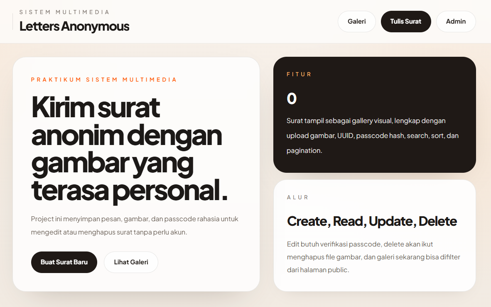

# Letters Anonymous

[](https://letters.taxcenterug.com/)

Project praktikum Sistem Multimedia berbasis `CodeIgniter 4`, `MySQL`, dan `Tailwind CSS CDN` untuk mengirim, menampilkan, mengelola, dan memoderasi surat anonim dengan gambar.

Website production dapat diakses di:

- [https://letters.taxcenterug.com/](https://letters.taxcenterug.com/)

Panduan deploy ke Hostinger VPS tersedia di:

- [DEPLOY_HOSTINGER_VPS.md](DEPLOY_HOSTINGER_VPS.md)

## Gambaran Umum

Letters Anonymous adalah aplikasi web yang memungkinkan pengguna mengirim surat anonim lengkap dengan gambar. Setiap surat memiliki `UUID`, gambar yang diunggah ke server, dan `passcode` rahasia yang di-hash untuk kebutuhan edit atau hapus tanpa sistem akun user biasa.

Di sisi lain, aplikasi juga menyediakan dashboard admin dengan login sederhana berbasis `.env` untuk moderasi data, pencarian, pengurutan, paginasi, edit, dan delete.

## Fitur Utama

- Public gallery untuk melihat seluruh surat terbaru dalam bentuk card visual.
- Form create surat anonim dengan upload gambar `JPG` atau `PNG`.
- Penyimpanan file gambar ke folder `public/uploads`.
- `UUID` sebagai primary key pada tabel `letters`.
- `Passcode` otomatis yang hanya ditampilkan sekali setelah surat berhasil dibuat.
- Penyimpanan `passcode` dalam bentuk hash menggunakan `password_hash()`.
- Verifikasi passcode untuk edit dan delete di sisi public.
- Search, sort, dan pagination di halaman public gallery.
- Halaman detail surat.
- Halaman edit surat oleh pemilik surat setelah verifikasi passcode.
- Delete surat sekaligus menghapus file gambar dari server.
- Login admin berbasis session.
- Dashboard admin untuk search, sort, pagination, edit, delete, dan moderasi surat tanpa passcode user.
- UI konsisten antara halaman public dan admin dengan Tailwind CDN.

## Teknologi yang Digunakan

- `PHP 8.2+`
- `CodeIgniter 4`
- `MySQL / MariaDB`
- `Tailwind CSS CDN`
- `XAMPP` untuk environment lokal

## Struktur Data

Tabel utama yang digunakan adalah `letters`.

Kolom:

- `id` : `CHAR(36)` sebagai UUID dan primary key
- `recipient` : nama atau tujuan surat
- `message` : isi surat
- `image_path` : path file gambar yang disimpan di server
- `passcode_hash` : hash passcode untuk edit/delete
- `created_at`
- `updated_at`

Migration ada di:

- [app/Database/Migrations/2026-04-22-213744_CreateLettersTable.php](app/Database/Migrations/2026-04-22-213744_CreateLettersTable.php)

## Alur Aplikasi

### 1. Create

Pengguna mengisi form surat, memilih gambar, lalu submit. Sistem akan:

- memvalidasi `recipient`, `message`, dan file gambar
- mengganti nama file gambar secara acak
- menyimpan file ke `public/uploads`
- membuat `UUID`
- membuat `passcode` acak
- menyimpan hash passcode ke database
- menampilkan passcode sekali di halaman detail

### 2. Read

Pengguna dapat:

- melihat gallery surat di halaman utama
- memakai search, sort, dan pagination
- membuka halaman detail setiap surat

### 3. Update

Pemilik surat dapat:

- memasukkan passcode di halaman detail
- membuka akses edit untuk sesi browser saat ini
- memperbarui isi surat dan gambar

Admin juga dapat:

- mengedit surat langsung dari dashboard admin tanpa passcode user

### 4. Delete

Pemilik surat dapat menghapus surat dengan passcode.

Admin juga dapat menghapus surat dari dashboard.

Saat delete dijalankan, sistem:

- menghapus row di database
- menghapus file gambar fisik dari folder `public/uploads`

## Fitur Public

Halaman public utama:

- `/`
- `/letters`

Fitur:

- hero section
- gallery surat
- search
- sort by `created_at`, `updated_at`, `recipient`
- direction `ASC` atau `DESC`
- pagination
- detail surat
- edit dengan passcode
- delete dengan passcode

View public:

- [app/Views/letters/index.php](app/Views/letters/index.php)
- [app/Views/letters/create.php](app/Views/letters/create.php)
- [app/Views/letters/show.php](app/Views/letters/show.php)
- [app/Views/letters/edit.php](app/Views/letters/edit.php)

Controller public:

- [app/Controllers/Letters.php](app/Controllers/Letters.php)

## Fitur Admin

Route admin:

- `/admin/login`
- `/admin`
- `/admin/letters/{id}/edit`

Fitur:

- login admin
- session admin
- proteksi route dengan filter
- dashboard tabel surat
- search
- sort
- pagination
- edit surat
- delete surat

Controller admin:

- [app/Controllers/AdminLetters.php](app/Controllers/AdminLetters.php)

Filter admin:

- [app/Filters/AdminAuth.php](app/Filters/AdminAuth.php)

View admin:

- [app/Views/admin/login.php](app/Views/admin/login.php)
- [app/Views/admin/index.php](app/Views/admin/index.php)
- [app/Views/admin/edit.php](app/Views/admin/edit.php)

## Konfigurasi Admin

Kredensial admin dikelola melalui environment aplikasi dan tidak ditampilkan di dokumentasi ini.

Konfigurasi terkait:

- [`.env`](.env)
- [env](env)

## Konfigurasi Database

Contoh konfigurasi `.env`:

```ini
CI_ENVIRONMENT = development

database.default.hostname = localhost
database.default.database = praktikum_sm
database.default.username = root
database.default.password =
database.default.DBDriver = MySQLi
database.default.DBPrefix =
database.default.port = 3306

admin.username = admin
admin.password_hash = '...'
```

## Cara Menjalankan Project

### 1. Install dependency

```bash
composer install
```

### 2. Siapkan environment

Copy file `env` menjadi `.env`, lalu isi konfigurasi database dan admin.

### 3. Buat database

Buat database baru, misalnya:

```sql
CREATE DATABASE praktikum_sm;
```

### 4. Jalankan migration

```bash
php spark migrate
```

### 5. Jalankan server development

```bash
php spark serve
```

Lalu buka:

```text
http://localhost:8080
```

## Command yang Dipakai Selama Pengembangan

Beberapa command penting:

```bash
php spark make:migration CreateLettersTable
php spark migrate
php spark migrate:status
php spark make:model LetterModel
php spark make:controller Letters
php spark make:controller AdminLetters
php spark make:filter AdminAuth
php spark routes
php spark db:table letters
php -l app\Controllers\Letters.php
php -l app\Controllers\AdminLetters.php
```

## Validasi Upload

Upload gambar dibatasi:

- wajib file gambar
- hanya `jpg`, `jpeg`, `png`
- ukuran maksimal `2MB`

## Lokasi File Penting

- [app/Controllers/Letters.php](app/Controllers/Letters.php)
- [app/Controllers/AdminLetters.php](app/Controllers/AdminLetters.php)
- [app/Filters/AdminAuth.php](app/Filters/AdminAuth.php)
- [app/Models/LetterModel.php](app/Models/LetterModel.php)
- [app/Config/Routes.php](app/Config/Routes.php)
- [app/Views/layouts/main.php](app/Views/layouts/main.php)
- [public/banner.png](public/banner.png)
- [public/uploads/index.html](public/uploads/index.html)

## Catatan Implementasi

- Public user tidak perlu akun.
- Edit/delete public menggunakan passcode.
- Passcode tidak disimpan dalam bentuk plaintext.
- Gambar disimpan sebagai file, bukan blob database.
- Dashboard admin dipisahkan dari alur user anonim.
- UI menggunakan Tailwind CDN, jadi tidak ada build step frontend tambahan.

## Lisensi

Project ini dibuat untuk kebutuhan praktikum dan pengembangan pembelajaran.
